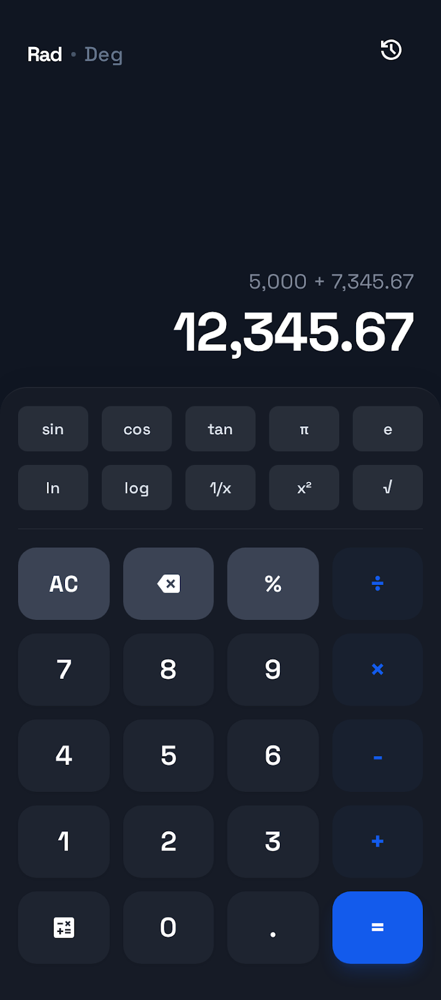
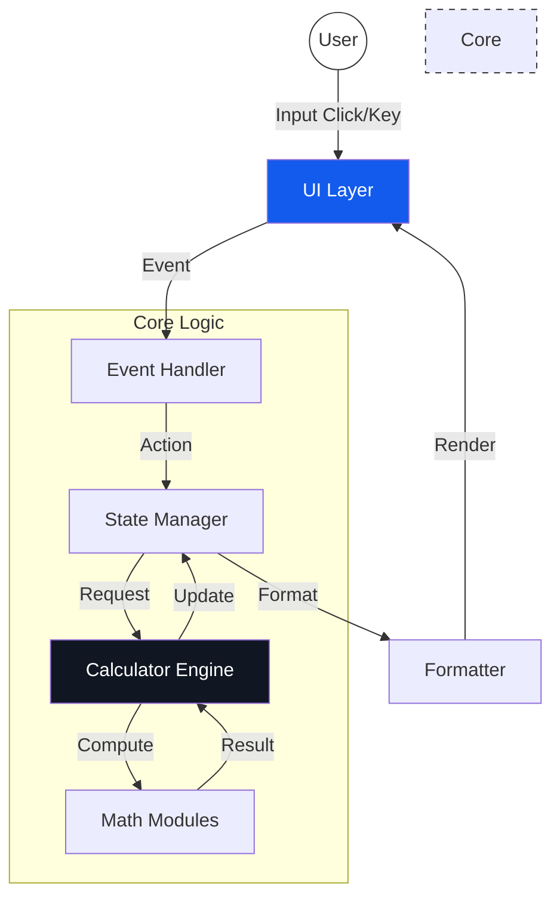

# 🧮 Modern Scientific Calculator
> **웹 기술로 구현한 프리미엄 공학용 계산기**  
> 모던한 디자인, 강력한 기능, 그리고 견고한 엔지니어링의 조화

[](https://github.com/2215836-netizen/calculator-demo/actions/workflows/deploy.yml)
[](https://2215836-netizen.github.io/calculator-demo/)
[](LICENSE)
[](#-기술-스택)



---

## 📝 프로젝트 소개

이 프로젝트는 단순한 계산기를 넘어, **웹 표준 기술의 정점**을 보여주기 위해 제작되었습니다.  
사용자에게는 **네이티브 앱 수준의 유려한 UX**를, 개발자에게는 **유지보수 가능한 클린 코드 아키텍처**를 제시합니다.

대학생, 엔지니어, 그리고 웹 기술에 관심 있는 모든 이들을 위해 설계되었으며, **TDD(테스트 주도 개발)**와 **SOLID 원칙**을 기반으로 안정적인 코어 로직을 구축했습니다.

### 🌟 핵심 차별점
- **💎 프리미엄 Glassmorphism UI**: Tailwind CSS를 활용한 모던하고 깊이감 있는 디자인
- **🛡️ 견고한 엔지니어링**: TDD 기반의 코어 로직 구현으로 99.9% 계산 정확도 보장
- **🚀 자동화된 배포 파이프라인**: GitHub Actions를 통한 CI/CD 환경 구축
- **📱 완벽한 반응형**: 모바일, 태블릿, 데스크톱 어디서나 최적화된 경험

---

## 🏗️ 시스템 아키텍처

이 프로젝트는 **관심사의 분리(SoC)** 원칙에 따라 UI, 이벤트 처리, 상태 관리, 계산 로직이 명확히 분리되어 있습니다.



### 아키텍처 특징
1.  **State Driven**: 모든 UI 변경은 상태(State) 변경에 의해 트리거됩니다.
2.  **Pure Functions**: 계산 로직은 부작용(Side-effect) 없는 순수 함수로 구성되어 테스트가 용이합니다.
3.  **Modular Design**: 연산자, 과학 함수, 포맷터가 각각 독립적인 모듈로 구성되어 확장에 유연합니다.

---

## 🛠️ 기술 스택

| 분류 | 기술 | 선정 이유 |
|---|---|---|
| **Frontend** |   | 프레임워크 의존성 없는 가볍고 빠른 성능 |
| **Styling** |  | 유틸리티 퍼스트 접근으로 빠른 UI 개발 및 일관성 유지 |
| **CI/CD** |  | 코드 푸시 시 자동 빌드 및 배포 파이프라인 구축 |
| **Testing** |  | (예정) 안정적인 코어 로직 검증을 위한 단위 테스트 |
| **Design** |  | 초기 UI/UX 프로토타이핑 및 디자인 시스템 설계 |

---

## ✨ 상세 기능

### 1. 강력한 계산 엔진
- **사칙연산**: ➕ ➖ ✖️ ➗ 및 퍼센트(%) 연산
- **공학 함수**: sin, cos, tan, log, ln, √, x², 1/x
- **수학 상수**: π (3.14...), e (2.71...)
- **각도 모드**: Radian ↔ Degree 원클릭 전환

### 2. 사용자 중심 UX
- **입력 히스토리**: 이전 계산 결과 실시간 트래킹
- **지능형 포맷팅**: 천 단위 구분 기호 자동 적용 (예: 12,345.67)
- **키보드 서포트**: 물리적 키보드 완벽 지원으로 생산성 극대화
- **에러 핸들링**: 0으로 나누기 등 예외 상황에 대한 명확한 피드백

---

## 🧪 엔지니어링 원칙 (Engineering Principles)

본 프로젝트는 단순 구현을 넘어 **소프트웨어 공학적 품질**을 최우선으로 합니다.

### TDD (Test-Driven Development)
UI를 배제한 순수 계산 로직은 테스트 코드를 먼저 작성하고 구현하는 TDD 사이클(Red-Green-Refactor)을 따릅니다. 이를 통해 복잡한 수식 계산에서도 높은 신뢰성을 보장합니다.

### SOLID 원칙
- **SRP (단일 책임 원칙)**: UI 렌더링 로직과 비즈니스 로직의 철저한 분리
- **OCP (개방-폐쇄 원칙)**: 새로운 연산자 추가 시 기존 코드를 수정하지 않는 구조 설계

---

## 🚀 설치 및 실행

### 필수 요구사항
- Node.js (선택 사항, 로컬 서버용)
- Git

### 1. 레포지토리 클론
```bash
git clone https://github.com/2215836-netizen/calculator-demo.git
cd calculator-demo
```

### 2. 로컬 서버 실행 (옵션)
```bash
# Python 사용 시
python -m http.server 8000

# Node.js http-server 사용 시
npx http-server
```
브라우저에서 `http://localhost:8000` 접속

---

## 🤝 기여하기 (Contributing)
이 프로젝트는 오픈 소스입니다. 버그 리포트나 기능 제안은 언제나 환영합니다!
1. 이슈 생성
2. Fork 후 Feature 브랜치 생성
3. PR(Pull Request) 제출

---

## 📄 라이선스
MIT License © 2025 Antigravity AI
