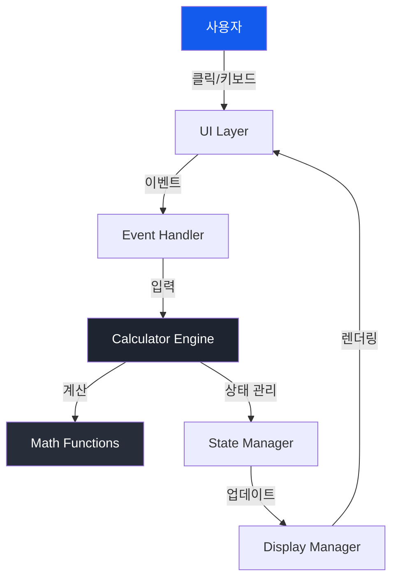

# Tech Spec: 공학용 계산기 (Scientific Calculator)

## 문서 정보
- **프로젝트명**: 공학용 계산기
- **버전**: 1.0
- **작성일**: 2025-12-23
- **작성자**: Antigravity AI
- **관련 문서**: [PRD.md](file:///c:/Users/UserK/Desktop/윤/UNI/cal/PRD.md)

---

## 1. 기술 스택 개요

### 1.1 프론트엔드 기술
| 기술 | 버전 | 용도 | 이유 |
|------|------|------|------|
| HTML5 | - | 마크업 | 시맨틱 구조, 접근성 |
| CSS3 | - | 스타일링 | 모던 레이아웃, 애니메이션 |
| Tailwind CSS | 3.x (CDN) | CSS 프레임워크 | 빠른 개발, 일관된 디자인 |
| JavaScript | ES6+ | 로직 구현 | 네이티브 지원, 빠른 성능 |

### 1.2 외부 라이브러리 및 리소스
| 리소스 | 버전 | CDN URL | 용도 |
|--------|------|---------|------|
| Tailwind CSS | 3.x | `https://cdn.tailwindcss.com` | 유틸리티 CSS |
| Google Fonts | - | `fonts.googleapis.com` | Space Grotesk 폰트 |
| Material Symbols | - | `fonts.googleapis.com/css2?family=Material+Symbols+Outlined` | 아이콘 |

### 1.3 개발 도구
- **코드 에디터**: VS Code, Sublime Text, WebStorm 등
- **브라우저 개발자 도구**: Chrome DevTools
- **버전 관리**: Git
- **로컬 서버**: Python HTTP Server, Live Server 등

---

## 2. 아키텍처 설계

### 2.1 시스템 아키텍처



### 2.2 파일 구조

```
cal/
├── index.html          # 메인 HTML 파일
├── app.js              # 계산기 로직
├── README.md           # 프로젝트 문서
├── PRD.md              # 제품 요구사항 문서
├── TECH_SPEC.md        # 기술 명세서 (본 문서)
└── docs/               # 참고 자료
    ├── stitch_.zip     # (삭제됨)
    ├── code.html       # 원본 디자인
    └── screen.png      # 디자인 스크린샷
```

### 2.3 컴포넌트 구조

```
Calculator App
├── Top Bar
│   ├── Angle Mode Toggle (Rad/Deg)
│   └── History Button
├── Display Area
│   ├── Expression Display (계산 과정)
│   └── Result Display (결과)
├── Scientific Functions Panel
│   ├── Trigonometric (sin, cos, tan)
│   ├── Logarithmic (ln, log)
│   ├── Power & Root (x², √)
│   ├── Reciprocal (1/x)
│   └── Constants (π, e)
└── Main Keypad
    ├── Action Buttons (AC, Backspace, %)
    ├── Number Buttons (0-9)
    ├── Operators (+, -, ×, ÷)
    └── Equals (=)
```

---

## 3. 데이터 구조

### 3.1 상태 관리

```javascript
const calculatorState = {
    // 현재 표시되는 값
    currentValue: "0",
    
    // 이전 값 (연산자 입력 후)
    previousValue: "",
    
    // 현재 연산자
    operator: null,
    
    // 계산 과정 표시용
    expression: "",
    
    // 각도 모드 (true: 라디안, false: 도)
    isRadianMode: true,
    
    // 새 숫자 입력 시작 여부
    shouldResetDisplay: false,
    
    // 계산 히스토리
    history: []
};
```

### 3.2 연산자 매핑

```javascript
const operators = {
    '+': (a, b) => a + b,
    '-': (a, b) => a - b,
    '×': (a, b) => a * b,
    '÷': (a, b) => a / b,
    '%': (a) => a / 100
};
```

### 3.3 과학 함수 매핑

```javascript
const scientificFunctions = {
    'sin': (x, isRad) => Math.sin(isRad ? x : toRadians(x)),
    'cos': (x, isRad) => Math.cos(isRad ? x : toRadians(x)),
    'tan': (x, isRad) => Math.tan(isRad ? x : toRadians(x)),
    'ln': (x) => Math.log(x),
    'log': (x) => Math.log10(x),
    'sqrt': (x) => Math.sqrt(x),
    'square': (x) => x * x,
    'reciprocal': (x) => 1 / x
};
```

---

## 4. 핵심 알고리즘

### 4.1 계산 엔진

#### 4.1.1 기본 연산 처리
```javascript
function calculate(prev, current, operator) {
    const a = parseFloat(prev);
    const b = parseFloat(current);
    
    if (isNaN(a) || isNaN(b)) return current;
    
    let result;
    switch(operator) {
        case '+': result = a + b; break;
        case '-': result = a - b; break;
        case '×': result = a * b; break;
        case '÷': 
            if (b === 0) return 'Error';
            result = a / b; 
            break;
        default: return current;
    }
    
    // 부동소수점 오차 처리
    return parseFloat(result.toFixed(10));
}
```

#### 4.1.2 과학 함수 처리
```javascript
function applyScientificFunction(func, value, isRadianMode) {
    const num = parseFloat(value);
    if (isNaN(num)) return 'Error';
    
    try {
        let result;
        switch(func) {
            case 'sin':
            case 'cos':
            case 'tan':
                const angle = isRadianMode ? num : num * Math.PI / 180;
                result = Math[func](angle);
                break;
            case 'ln':
                result = Math.log(num);
                break;
            case 'log':
                result = Math.log10(num);
                break;
            case 'sqrt':
                result = Math.sqrt(num);
                break;
            case 'square':
                result = num * num;
                break;
            case 'reciprocal':
                result = 1 / num;
                break;
            default:
                return 'Error';
        }
        
        return parseFloat(result.toFixed(10));
    } catch (e) {
        return 'Error';
    }
}
```

### 4.2 입력 처리

#### 4.2.1 숫자 입력
```javascript
function handleNumberInput(digit) {
    if (state.shouldResetDisplay) {
        state.currentValue = digit;
        state.shouldResetDisplay = false;
    } else {
        state.currentValue = state.currentValue === '0' 
            ? digit 
            : state.currentValue + digit;
    }
    updateDisplay();
}
```

#### 4.2.2 소수점 입력
```javascript
function handleDecimalInput() {
    if (state.shouldResetDisplay) {
        state.currentValue = '0.';
        state.shouldResetDisplay = false;
    } else if (!state.currentValue.includes('.')) {
        state.currentValue += '.';
    }
    updateDisplay();
}
```

### 4.3 디스플레이 포맷팅

```javascript
function formatNumber(num) {
    // 숫자를 천 단위로 구분
    const parts = num.toString().split('.');
    parts[0] = parts[0].replace(/\B(?=(\d{3})+(?!\d))/g, ',');
    return parts.join('.');
}
```

---

## 5. UI/UX 구현

### 5.1 Tailwind CSS 설정

```javascript
tailwind.config = {
    darkMode: "class",
    theme: {
        extend: {
            colors: {
                "primary": "#135bec",
                "background-light": "#f6f6f8",
                "background-dark": "#101622",
                "surface-dark": "#1e2430",
                "surface-light": "#ffffff",
            },
            fontFamily: {
                "display": ["Space Grotesk", "sans-serif"]
            },
            borderRadius: {
                "DEFAULT": "0.25rem",
                "lg": "0.5rem",
                "xl": "0.75rem",
                "2xl": "1rem",
                "full": "9999px"
            },
        },
    },
}
```

### 5.2 버튼 스타일 클래스

#### 5.2.1 숫자 버튼
```html
<!-- 흰색 배경, 그림자 효과 -->
<button class="h-16 flex items-center justify-center rounded-2xl 
               bg-white dark:bg-surface-dark 
               text-slate-900 dark:text-white 
               text-2xl font-semibold shadow-sm 
               hover:brightness-110 active:scale-95 transition-all">
```

#### 5.2.2 연산자 버튼
```html
<!-- 파란색 강조 -->
<button class="h-16 flex items-center justify-center rounded-2xl 
               bg-blue-100 dark:bg-[#18202f] 
               text-primary text-2xl font-bold 
               hover:brightness-110 active:scale-95 transition-all">
```

#### 5.2.3 과학 함수 버튼
```html
<!-- 회색 배경 -->
<button class="h-10 flex items-center justify-center rounded-lg 
               bg-slate-200 dark:bg-[#282e39] 
               text-slate-700 dark:text-slate-200 
               text-sm font-medium 
               hover:brightness-110 active:scale-95 transition-all">
```

#### 5.2.4 액션 버튼 (AC, Backspace)
```html
<!-- 진한 회색 배경 -->
<button class="h-16 flex items-center justify-center rounded-2xl 
               bg-slate-300 dark:bg-[#3b4354] 
               text-slate-900 dark:text-white 
               text-xl font-bold 
               hover:brightness-110 active:scale-95 transition-all">
```

#### 5.2.5 등호 버튼
```html
<!-- Primary 색상, 그림자 효과 -->
<button class="h-16 flex items-center justify-center rounded-2xl 
               bg-primary text-white text-2xl font-bold 
               shadow-lg shadow-primary/20 
               hover:brightness-110 active:scale-95 transition-all">
```

### 5.3 애니메이션

```css
/* 버튼 호버 효과 */
.hover\:brightness-110:hover {
    filter: brightness(1.1);
}

/* 버튼 클릭 효과 */
.active\:scale-95:active {
    transform: scale(0.95);
}

/* 부드러운 전환 */
.transition-all {
    transition-property: all;
    transition-timing-function: cubic-bezier(0.4, 0, 0.2, 1);
    transition-duration: 150ms;
}
```

---

## 6. 이벤트 처리

### 6.1 버튼 클릭 이벤트

```javascript
// 이벤트 위임 패턴 사용
document.addEventListener('DOMContentLoaded', () => {
    const keypad = document.getElementById('keypad');
    
    keypad.addEventListener('click', (e) => {
        const button = e.target.closest('button');
        if (!button) return;
        
        const action = button.dataset.action;
        const value = button.dataset.value;
        
        handleButtonClick(action, value);
    });
});
```

### 6.2 키보드 이벤트

```javascript
document.addEventListener('keydown', (e) => {
    const key = e.key;
    
    // 숫자 키
    if (/^[0-9]$/.test(key)) {
        handleNumberInput(key);
    }
    // 연산자 키
    else if (['+', '-', '*', '/'].includes(key)) {
        const operator = key === '*' ? '×' : key === '/' ? '÷' : key;
        handleOperator(operator);
    }
    // Enter (=)
    else if (key === 'Enter') {
        e.preventDefault();
        handleEquals();
    }
    // Backspace
    else if (key === 'Backspace') {
        handleBackspace();
    }
    // Escape (AC)
    else if (key === 'Escape') {
        handleClear();
    }
    // 소수점
    else if (key === '.') {
        handleDecimalInput();
    }
});
```

---

## 7. 성능 최적화

### 7.1 렌더링 최적화

```javascript
// requestAnimationFrame 사용
function updateDisplay() {
    requestAnimationFrame(() => {
        displayElement.textContent = formatNumber(state.currentValue);
        expressionElement.textContent = state.expression;
    });
}
```

### 7.2 이벤트 디바운싱

```javascript
// 연속 입력 시 성능 향상
function debounce(func, wait) {
    let timeout;
    return function executedFunction(...args) {
        const later = () => {
            clearTimeout(timeout);
            func(...args);
        };
        clearTimeout(timeout);
        timeout = setTimeout(later, wait);
    };
}
```

### 7.3 메모리 관리

```javascript
// 히스토리 최대 개수 제한
const MAX_HISTORY = 50;

function addToHistory(entry) {
    state.history.unshift(entry);
    if (state.history.length > MAX_HISTORY) {
        state.history.pop();
    }
}
```

---

## 8. 에러 처리

### 8.1 계산 에러

```javascript
function safeCalculate(operation) {
    try {
        const result = operation();
        
        // NaN 체크
        if (isNaN(result)) {
            return 'Error';
        }
        
        // Infinity 체크
        if (!isFinite(result)) {
            return 'Error';
        }
        
        return result;
    } catch (error) {
        console.error('Calculation error:', error);
        return 'Error';
    }
}
```

### 8.2 입력 검증

```javascript
function validateInput(value) {
    // 빈 문자열 체크
    if (value === '') return false;
    
    // 숫자 형식 체크
    if (!/^-?\d*\.?\d+$/.test(value)) return false;
    
    // 범위 체크
    const num = parseFloat(value);
    if (Math.abs(num) > Number.MAX_SAFE_INTEGER) return false;
    
    return true;
}
```

---

## 9. 테스트 전략

### 9.1 단위 테스트 (자동화 - TDD)
- 코어 로직(계산, 포맷팅)에 한해 Jest로 자동화 테스트 수행

### 9.2 UI/통합 테스트 (수동)
- UI 컴포넌트, DOM 조작, 이벤트 핸들러는 자동화하지 않음
- 브라우저에서 직접 기능 수행하여 검증

#### 9.2.1 기본 연산 테스트 (수동)
```javascript
// 테스트 케이스
const basicTests = [
    { input: '5 + 3', expected: 8 },
    { input: '10 - 4', expected: 6 },
    { input: '6 × 7', expected: 42 },
    { input: '15 ÷ 3', expected: 5 },
    { input: '10 ÷ 0', expected: 'Error' }
];
```

#### 9.1.2 과학 함수 테스트
```javascript
const scientificTests = [
    { func: 'sin', input: 30, mode: 'deg', expected: 0.5 },
    { func: 'cos', input: 0, mode: 'rad', expected: 1 },
    { func: 'sqrt', input: 16, expected: 4 },
    { func: 'square', input: 5, expected: 25 },
    { func: 'ln', input: Math.E, expected: 1 }
];
```

### 9.2 통합 테스트

```javascript
// 복잡한 수식 테스트
const integrationTests = [
    { input: '5 + 3 × 2', note: '연산자 우선순위는 미지원, 순차 계산' },
    { input: 'sin(30°) + cos(60°)', expected: 1 },
    { input: 'π × 5²', expected: 78.54 }
];
```

### 9.3 브라우저 호환성 테스트

| 브라우저 | 버전 | 테스트 항목 |
|---------|------|------------|
| Chrome | 최신 2개 | 전체 기능 |
| Firefox | 최신 2개 | 전체 기능 |
| Safari | 최신 2개 | 전체 기능 |
| Edge | 최신 2개 | 전체 기능 |

---

## 10. 배포 전략

### 10.1 GitHub Actions CI/CD

#### 10.1.1 워크플로우 구성
- **파일**: `.github/workflows/deploy.yml`
- **트리거**: `main` 브랜치 푸시 또는 수동 실행
- **권한**: Pages write, contents read

#### 10.1.2 배포 단계
```yaml
1. Checkout: 코드 체크아웃
2. Setup Pages: GitHub Pages 환경 설정
3. Build: 프로젝트 빌드 및 검증
4. Validate: 필수 파일 확인 (index.html, app.js)
5. Upload: 아티팩트 업로드
6. Deploy: GitHub Pages에 배포
```

#### 10.1.3 자동 배포 프로세스
```bash
# 1. 코드 변경 및 커밋
git add .
git commit -m "Update calculator"
git push origin main

# 2. GitHub Actions 자동 실행
# 3. 배포 완료 후 접속
# https://2215836-netizen.github.io/calculator-demo/
```

### 10.2 GitHub Pages 설정

#### 10.2.1 초기 설정
1. GitHub 저장소 Settings > Pages
2. Source: `GitHub Actions` 선택
3. 워크플로우 자동 실행

#### 10.2.2 배포 URL
```
https://2215836-netizen.github.io/calculator-demo/
```

### 10.3 빌드 프로세스

현재는 빌드 프로세스가 필요 없음 (순수 HTML/CSS/JS)
- CDN을 통한 Tailwind CSS 사용
- 번들러 불필요
- 파일 검증만 수행
- 즉시 배포 가능

### 10.4 배포 문서

자세한 배포 가이드는 [DEPLOYMENT.md](file:///c:/Users/UserK/Desktop/윤/UNI/cal/.github/DEPLOYMENT.md) 참조

---

## 11. 보안 고려사항

### 11.1 XSS 방지
```javascript
// textContent 사용 (innerHTML 대신)
displayElement.textContent = value; // ✓ 안전
// displayElement.innerHTML = value; // ✗ 위험
```

### 11.2 입력 검증
```javascript
// 악의적인 입력 필터링
function sanitizeInput(input) {
    return input.replace(/[^0-9+\-×÷.()]/g, '');
}
```

---

## 12. 접근성 (Accessibility)

### 12.1 ARIA 속성

```html
<!-- 버튼에 명확한 레이블 -->
<button aria-label="숫자 7">7</button>
<button aria-label="더하기">+</button>
<button aria-label="전체 삭제">AC</button>

<!-- 디스플레이 영역 -->
<div role="status" aria-live="polite" aria-atomic="true">
    <h1>12,345.67</h1>
</div>
```

### 12.2 키보드 네비게이션
- 모든 버튼은 Tab 키로 접근 가능
- Enter/Space로 버튼 활성화
- 키보드만으로 모든 기능 사용 가능

### 12.3 색상 대비
- WCAG 2.1 AA 기준 준수
- 텍스트와 배경 간 충분한 대비
- 다크 모드에서도 가독성 유지

---

## 13. 모니터링 및 로깅

### 13.1 에러 로깅

```javascript
// 개발 환경에서만 로깅
const DEBUG = true;

function log(message, data) {
    if (DEBUG) {
        console.log(`[Calculator] ${message}`, data);
    }
}

function logError(message, error) {
    console.error(`[Calculator Error] ${message}`, error);
}
```

### 13.2 사용자 행동 추적 (선택사항)

```javascript
// Google Analytics 또는 기타 분석 도구
function trackEvent(category, action, label) {
    if (typeof gtag !== 'undefined') {
        gtag('event', action, {
            'event_category': category,
            'event_label': label
        });
    }
}

// 예시
trackEvent('Calculator', 'button_click', 'sin');
```

---

## 14. 향후 기술 개선

### 14.1 단기 개선
- **LocalStorage**: 히스토리 및 설정 저장
- **Service Worker**: 오프라인 지원
- **CSS Variables**: 테마 커스터마이징

### 14.2 중기 개선
- **TypeScript**: 타입 안정성 향상
- **React/Vue**: 컴포넌트 기반 리팩토링
- **Math.js**: 복잡한 수식 파싱

### 14.3 장기 개선
- **PWA**: 앱처럼 설치 가능
- **WebAssembly**: 고성능 계산
- **GraphQL**: 히스토리 동기화

---

## 15. 참고 자료

### 15.1 공식 문서
- [MDN Web Docs - Math](https://developer.mozilla.org/en-US/docs/Web/JavaScript/Reference/Global_Objects/Math)
- [Tailwind CSS Documentation](https://tailwindcss.com/docs)
- [Google Fonts](https://fonts.google.com/)
- [Material Symbols](https://fonts.google.com/icons)

### 15.2 관련 표준
- [IEEE 754 (부동소수점 연산)](https://en.wikipedia.org/wiki/IEEE_754)
- [WCAG 2.1 (웹 접근성)](https://www.w3.org/WAI/WCAG21/quickref/)

### 15.3 프로젝트 문서
- [PRD.md](file:///c:/Users/UserK/Desktop/윤/UNI/cal/PRD.md)
- [원본 디자인](file:///c:/Users/UserK/Desktop/윤/UNI/cal/docs/code.html)

---

## 16. 용어 정리

| 용어 | 설명 |
|------|------|
| **Rad** | 라디안 (Radian) - 각도 단위 |
| **Deg** | 도 (Degree) - 각도 단위 |
| **sin/cos/tan** | 삼각 함수 (사인/코사인/탄젠트) |
| **ln** | 자연로그 (Natural Logarithm, 밑이 e) |
| **log** | 상용로그 (Common Logarithm, 밑이 10) |
| **π (Pi)** | 원주율 (≈ 3.14159) |
| **e (Euler's number)** | 자연상수 (≈ 2.71828) |
| **AC** | All Clear - 전체 삭제 |

---

## 17. 변경 이력

| 버전 | 날짜 | 변경 내용 | 작성자 |
|------|------|----------|--------|
| 1.0 | 2025-12-23 | 초기 작성 | Antigravity AI |

---

## 18. 승인

| 역할 | 이름 | 날짜 | 서명 |
|------|------|------|------|
| 기술 리드 | - | - | - |
| 개발자 | - | - | - |
| 검토자 | - | - | - |

---

**문서 상태**: ✅ 승인 대기  
**다음 검토 예정일**: 2025-12-30
